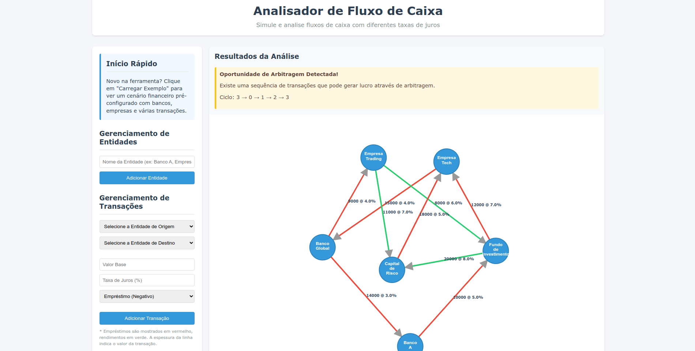

# Programação Dinâmica

**Número da Lista**: 17<br>
**Conteúdo da Disciplina**: Programação Dinâmica<br>

## Alunos
|Matrícula | Aluno |
| -- | -- |
| 21/1030700  |  Chaydson Ferreira da Aparecida |
| 21/1030676  |  Ana Luíza Rodrigues da Silva |

# Analisador de Fluxo de Caixa Financeiro

Este projeto implementa uma ferramenta de análise de fluxo de caixa usando o algoritmo de Bellman-Ford para simular e otimizar cenários de fluxo de caixa. Ele considera dívidas com taxas de juros variáveis e penalidades como pesos negativos em uma estrutura de grafo.

## Funcionalidades
- Visualização interativa do grafo de cenários de fluxo de caixa
- Implementação do algoritmo de Bellman-Ford para encontrar o caminho ótimo
- Suporte para pesos negativos (penalidades e taxas de juros)
- Simulação e análise em tempo real

## Requisitos
- Python 3.8+
- Flask
- NetworkX
- D3.js (incluído via CDN)

## Instalação e Execução

### Usando Docker (Recomendado)
1. Clone este repositório
2. Na pasta do projeto, execute:
```bash
sudo docker compose up --build
```
3. Acesse http://localhost:5000 no seu navegador

### Instalação Manual
1. Clone este repositório
2. Instale as dependências: 
```bash
pip install -r requirements.txt
```
3. Execute a aplicação: 
```bash
python app.py
```
4. Acesse http://localhost:5000 no seu navegador

## Como Usar
1. Adicione nós representando entidades financeiras
2. Defina conexões com custos/ganhos associados
3. Execute a simulação para encontrar caminhos ótimos de fluxo de caixa
4. Analise os resultados através da visualização interativa

## Screenshots



## Vídeo de Apresentação
https://youtu.be/1f8dg3RIQGo